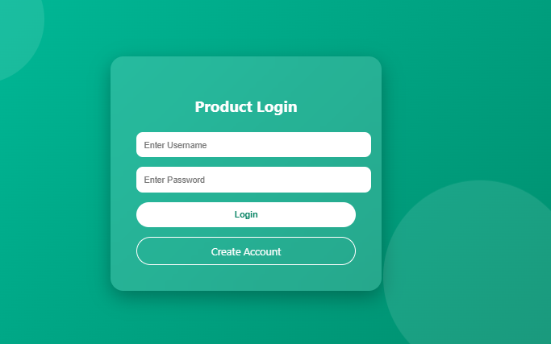
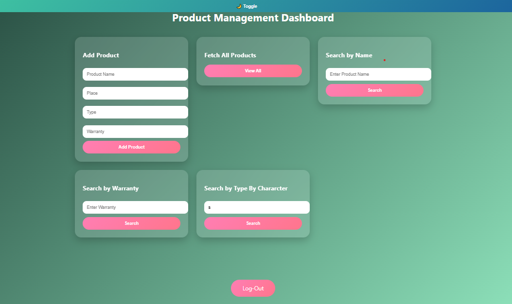
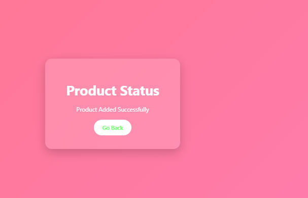
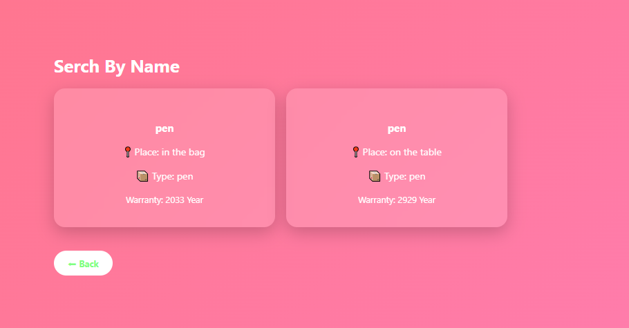
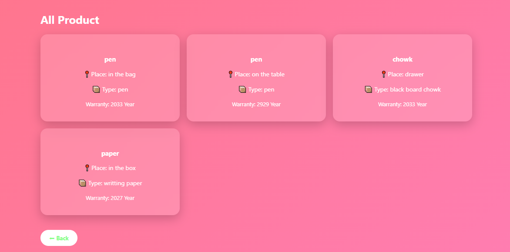

# 🚀 Product Management System

A modern **Spring Boot + Thymeleaf** web application to manage products with authentication and dynamic search features.

## 🌟 Features

✨ User Login System (Session-based)
📦 Add New Products
🔍 Search Products by Name
🔎 Search Products by Type (Partial Search Supported)
📊 View All Products
🎨 Modern UI with Animations
🔒 Logout & Session Protection

## 🖼️ Screenshots

### 🔐 Login Page



### 📊 Dashboard



### ➕ Add Product



### 🔍 Search Feature



### 📦 Product List




## 🛠️ Tech Stack

* ☕ Java
* 🌱 Spring Boot
* 🧩 Spring Data JPA
* 🗄️ MySQL
* 🎨 HTML + CSS + Thymeleaf
* 🔐 HttpSession (Authentication)

## ⚙️ Setup Instructions

### 1️⃣ Clone Repository

```bash
git clone https://github.com/your-username/product-management-system.git
cd product-management-system

### 2️⃣ Configure Database

Update `application.properties`:

```properties
spring.datasource.url=jdbc:mysql://localhost:3306/your_db
spring.datasource.username=root
spring.datasource.password=your_password

spring.jpa.hibernate.ddl-auto=update
spring.jpa.show-sql=true

### 3️⃣ Run Application

```bash
mvn spring-boot:run
```

👉 Open in browser:

```
http://localhost:8080/login
```

## 🔐 Authentication Flow

* User logs in
* Session is created
* Protected pages require session
* Logout destroys session
* Back button access is restricted

---

## 📁 Project Structure

```
src/
 ├── controller/
 ├── repo/
 ├── model/
 ├── templates/
 └── static/
```

## 🚀 Future Improvements

* 🔐 Spring Security Integration
* 📱 Responsive Mobile UI
* ⚡ Live Search (AJAX)
* 📊 Pagination & Sorting
* 🌐 Deployment (Render / Railway)

## 🙋‍♂️ Author

**Naeem Shaikh**

## ⭐ Support

If you like this project:

👉 Star ⭐ the repository
👉 Share with others

---

## 📌 Note

Make sure your `images` folder is inside the project root like:

```
project-folder/
 ├── images/
 │    ├── login.png
 │    ├── dashboard.png
 │    ├── add-product.png
 │    └── search.png
 └── README.md
```
